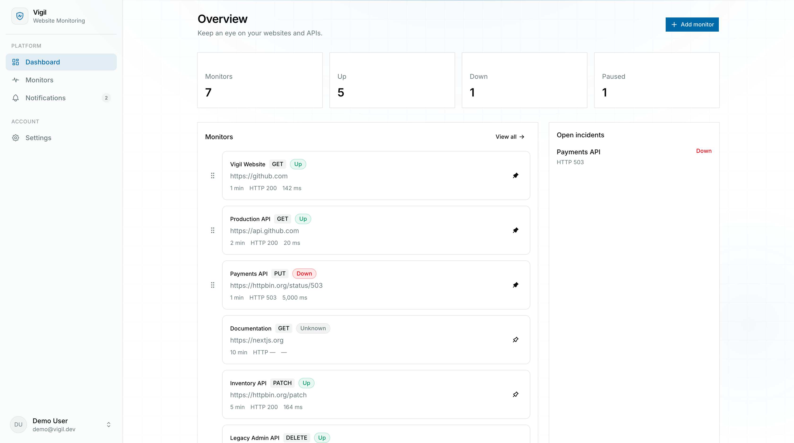
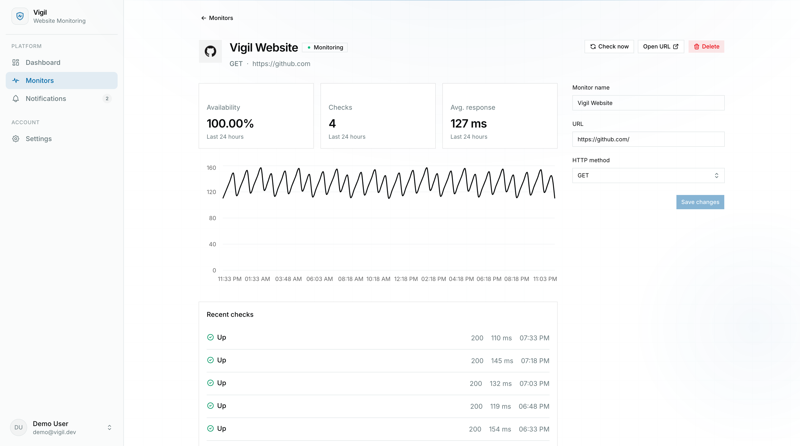
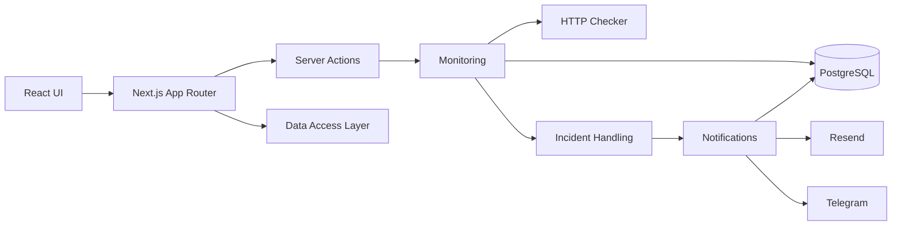

# Vigil

**Uptime monitoring for websites and APIs.**

Vigil is a full-stack monitoring SaaS built with Next.js, TypeScript, PostgreSQL, and Prisma. It checks configured endpoints, records response data, tracks incidents, and notifies users when monitors go down or recover.

> Portfolio project focused on practical full-stack engineering with the Next.js App Router.

[](https://github.com/frshaad/vigil/actions/workflows/ci.yml)


<!-- Add your deployed URL here -->

[Live Demo](https://vigil-eta-nine.vercel.app/)

---

## Screenshots

### Dashboard



### Monitor details



### Demo


---

## What it does

- Monitor websites and HTTP APIs on configurable intervals
- Run manual checks with cooldown protection
- Record HTTP status, response time, errors, and check history
- Track open and resolved incidents
- Create in-app, email, and Telegram notifications
- Pause and resume monitors
- View monitor metrics and response-time history
- Authenticate with email/password, Google, or GitHub
- Responsive dashboard with loading, empty, and error states
- Automatic first check after creating a monitor

---

## Technical highlights

### Next.js App Router

Vigil uses Next.js as the full-stack application framework:

- Server Components for server-side data fetching
- Server Actions for authenticated mutations
- Route Handlers where an HTTP endpoint is appropriate
- `loading.tsx` and Suspense boundaries for loading states
- Cache tags and route revalidation for fresh dashboard data

### Monitoring and incident handling

A monitor check follows a single server-side execution path:

```text
HTTP request
    ↓
Parse result
    ↓
Persist check + update monitor state
    ↓
Detect incident transition
    ↓
Create / resolve incident
    ↓
Dispatch notifications
```

Check persistence and incident transitions are handled in a serializable Prisma transaction, while manual checks use an atomic cooldown claim to prevent concurrent duplicate checks.

### Authentication & authorization

Better Auth provides:

- Email/password authentication
- Google OAuth
- GitHub OAuth
- Server-side session handling

Monitor access and mutations are always scoped to the authenticated user.

### Notifications

Notification delivery is separated from incident detection.

Current channels:

- In-app
- Email via Resend + React Email
- Telegram

---

## Architecture



The codebase uses a feature-based structure:

```text
src/
├── app/
├── components/
├── features/
│   ├── monitors/
│   ├── monitoring/
│   ├── notifications/
│   ├── email/
│   └── sidebar/
└── lib/

prisma/
└── schema.prisma
```

---

## Tech stack

| Area            | Tools                            |
| --------------- | -------------------------------- |
| Framework       | Next.js 16, React 19             |
| Language        | TypeScript                       |
| Database        | PostgreSQL                       |
| ORM             | Prisma                           |
| Auth            | Better Auth                      |
| Validation      | Zod                              |
| Server Actions  | next-safe-action                 |
| UI              | Tailwind CSS, shadcn/ui, Base UI |
| Icons           | Tabler Icons                     |
| Email           | Resend, React Email              |
| Notifications   | Telegram, in-app notifications   |
| Package manager | pnpm                             |
| Quality         | Oxlint, Oxfmt, Husky             |
| CI              | GitHub Actions                   |

---

## Local development

### Requirements

- Node.js 24+
- pnpm 11+
- PostgreSQL

### Setup

```bash
git clone https://github.com/frshaad/vigil.git
cd vigil

pnpm install
cp .env.example .env

pnpm db:migrate
pnpm dev
```

The app runs at `http://localhost:3000`.

---

## Demo account

The seed includes a demo account with representative data covering different monitor states, incidents, notifications, and notification channels.

```text
Email:    demo@vigil.dev
Password: DemoPassword123!
```

Use these credentials only with the deployed/public demo environment.

---

## CI

GitHub Actions runs the project's main verification checks on pushes to `main` and pull requests:

```text
pnpm install --frozen-lockfile
        ↓
lint
        ↓
typecheck
        ↓
production build
```

The goal is to keep CI small while still catching the most important integration and build problems.

---

## Scope

Vigil currently focuses on HTTP uptime monitoring and the core workflow around it.

More advanced infrastructure such as multi-region probing, distributed workers, escalation policies, and large-scale job queues is outside the current scope.
