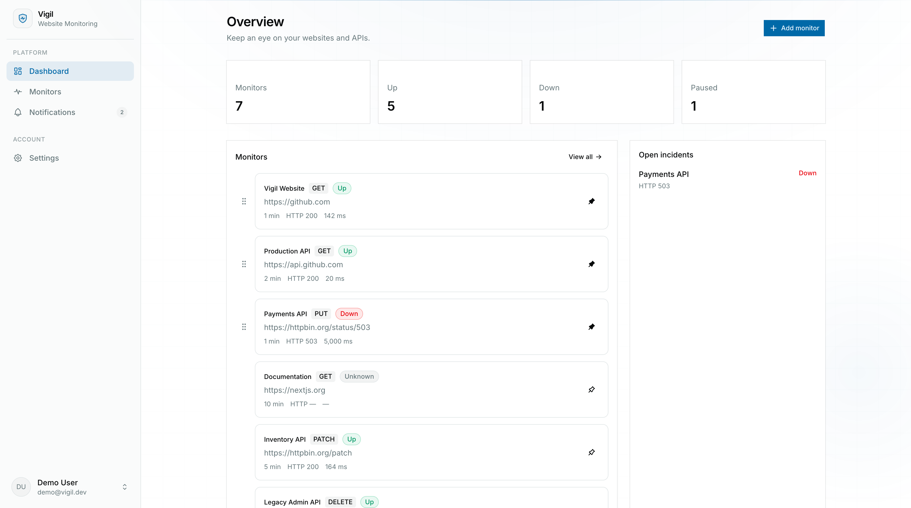
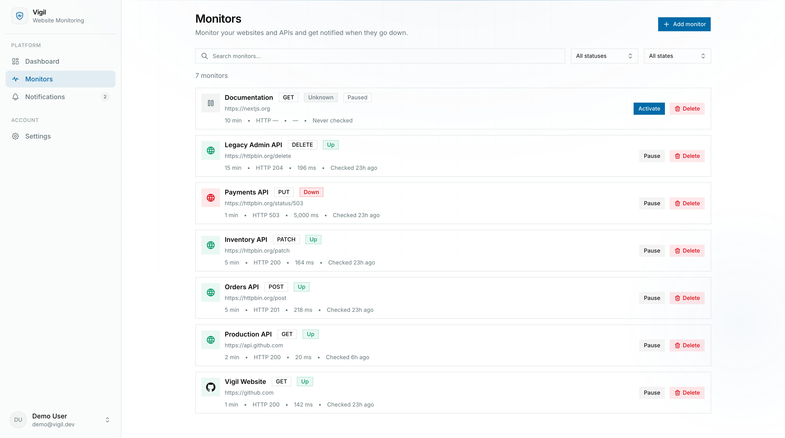
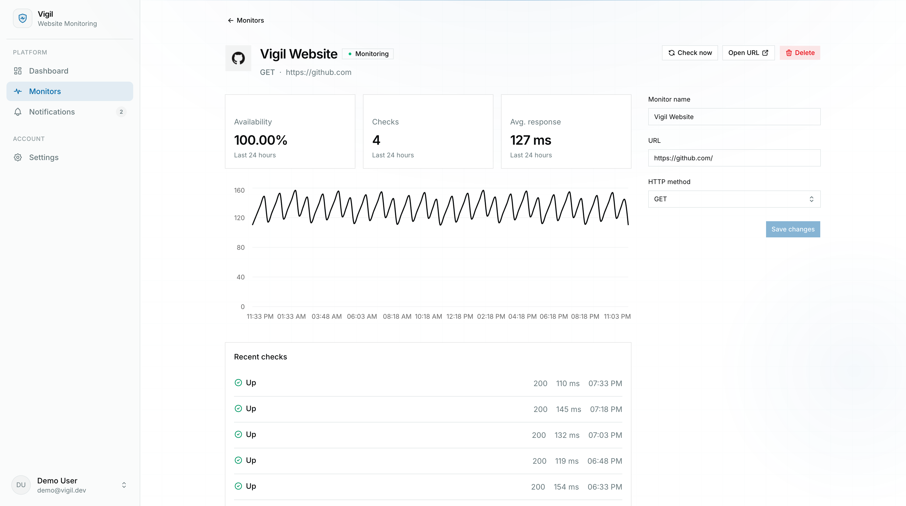
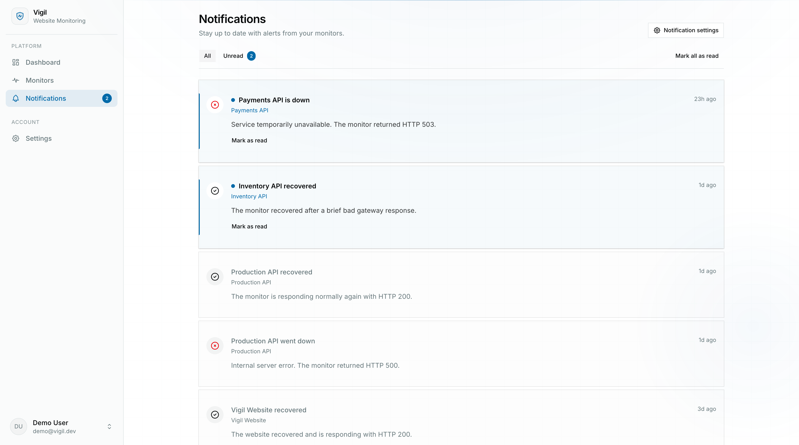
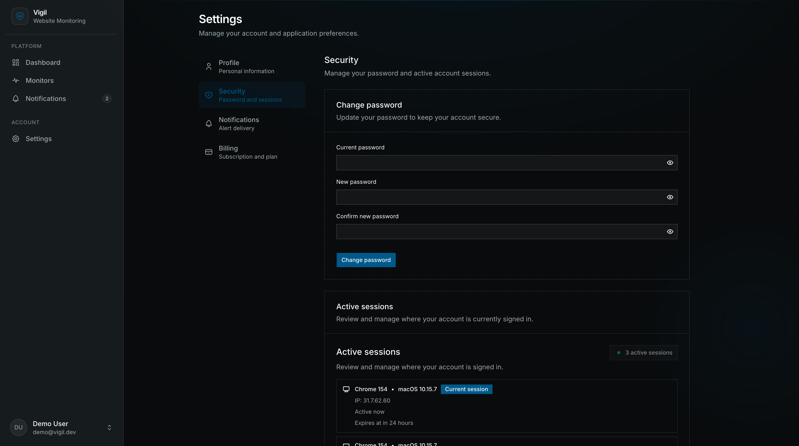
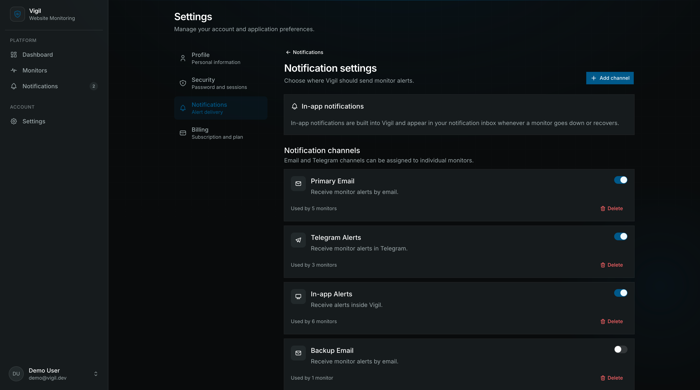
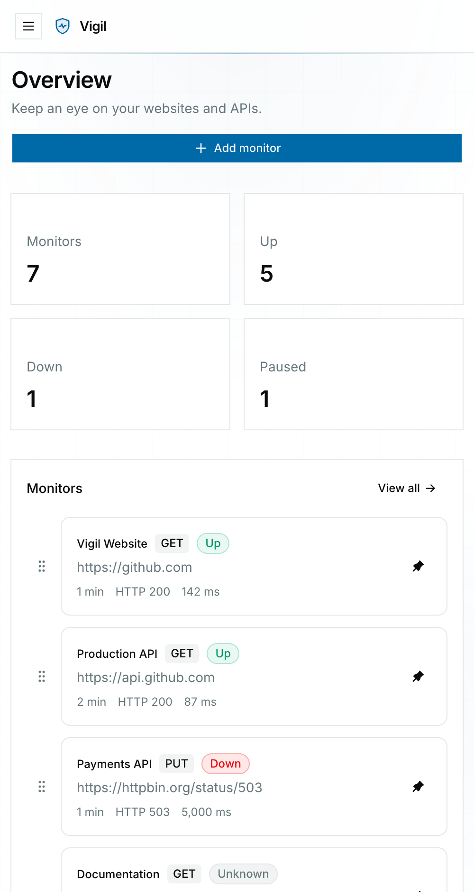
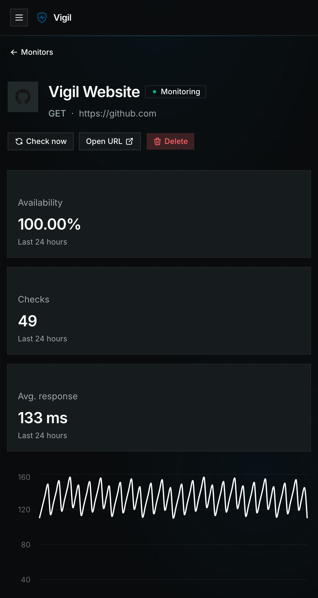

# Vigil

**Uptime monitoring for websites and APIs.**

Vigil is a full-stack monitoring SaaS built with Next.js, TypeScript, PostgreSQL, and Prisma. It checks HTTP endpoints, stores check history, tracks incidents, and sends notifications when a monitor goes down or recovers.

> A portfolio project focused on practical full-stack engineering with the Next.js App Router.

[](https://github.com/frshaad/vigil/actions/workflows/ci.yml)


[Live Demo](https://vigil-eta-nine.vercel.app/)

**Demo account**

```text
Email:    demo@vigil.dev
Password: DemoPassword123!
```

---

## Tech stack

| Area            | Tools                                    |
| --------------- | ---------------------------------------- |
| Framework       | Next.js 16, React 19                     |
| Language        | TypeScript                               |
| Database        | PostgreSQL (Neon)                        |
| ORM             | Prisma 7                                 |
| Authentication  | Better Auth                              |
| Validation      | Zod                                      |
| Mutations       | Next.js Server Actions, next-safe-action |
| API             | Next.js Route Handlers                   |
| UI              | Tailwind CSS, shadcn/ui, Base UI         |
| Icons           | Tabler Icons                             |
| Email           | Resend, React Email                      |
| Package manager | pnpm                                     |
| Code quality    | Oxlint, Oxfmt, Husky                     |
| CI              | GitHub Actions                           |
| Deployment      | Vercel                                   |

---

## Screenshots

### Dashboard

|                                                       |                                                                         |
| :---------------------------------------------------: | :---------------------------------------------------------------------: |
|        |                             |
|  |                        |
|                   |  |
|                    |                       |

---

## What it does

- Create and manage website and API monitors
- Check endpoints at configurable intervals
- Run manual checks with cooldown protection
- Store HTTP status, response time, errors, and check history
- Track open and resolved incidents
- Send in-app and email notifications
- Pause and resume monitors
- View monitor metrics and response-time history
- Authenticate with email/password, Google, or GitHub
- Use the dashboard on desktop and mobile
- Run the first monitor check automatically after creation

---

## Engineering highlights

### Next.js App Router

Vigil uses the Next.js App Router as the main full-stack architecture.

- **Server Components** for server-side data fetching
- **Server Actions** for authenticated mutations
- **Route Handlers** for HTTP endpoints such as the monitoring cron endpoint
- `loading.tsx` and Suspense for loading states
- Cache tags and route revalidation for fresh dashboard data
- React Compiler enabled

### Authentication and authorization

Better Auth handles authentication and sessions.

- Email/password authentication
- Google OAuth
- GitHub OAuth
- Server-side session handling
- User ownership checks for monitors and notification settings

All monitor data and mutations are scoped to the authenticated user.

### TypeScript and validation

TypeScript is used across the application with strict type checking.

Zod is used to validate action input and configuration data before it reaches the database or external services.

The project also uses Next.js typed routes to catch invalid application routes at build time.

### Database and Prisma

Vigil uses PostgreSQL with Prisma as the ORM.

The database includes relational models for:

- Users and sessions
- Monitors
- Monitor check history
- Incidents
- Notification channels
- In-app notifications
- Subscriptions
- Monitor preferences

Database writes that update monitor state and incident state are handled in a serializable Prisma transaction.

### Monitoring and incident handling

Monitor checks follow one server-side flow:

```text
Run check
   ↓
Store check result
   ↓
Update monitor status
   ↓
Detect status change
   ↓
Create / resolve incident
   ↓
Send notifications
```

Manual checks use an atomic cooldown claim to prevent concurrent duplicate checks.

Incident creation and recovery are based on monitor status transitions instead of treating every failed request as a new incident.

### Notifications

Notification delivery is separated from monitoring logic.

Current notification methods:

- In-app notifications
- Email via Resend and React Email

In-app notifications are available by default. Email notifications can be connected to individual monitors.

### Feature-based project structure

The codebase is organized around features instead of putting all files into global type-based folders.

```text
src/
├── app/
├── components/
├── features/
│   ├── monitors/
│   ├── monitoring/
│   ├── notifications/
│   └── email/
└── lib/

prisma/
└── schema.prisma
```

This keeps monitor logic, notification logic, data access, actions, and UI components close to the feature they belong to.

### Code quality and CI

The project uses:

- Oxlint for linting
- Oxfmt for formatting
- TypeScript type checking
- Husky for Git hooks
- GitHub Actions for CI

The main CI checks are:

```text
Install dependencies
        ↓
Lint
        ↓
Typecheck
        ↓
Production build
```

---

## Architecture

The main application flow is intentionally simple:

```text
                    ┌──────────────────┐
                    │   Next.js App    │
                    │    Router        │
                    └────────┬─────────┘
                             │
          ┌──────────────────┼──────────────────┐
          │                  │                  │
          ▼                  ▼                  ▼
   Server Components   Server Actions     Route Handlers
          │                  │                  │
          │               Zod + Auth           │
          └──────────────────┼──────────────────┘
                             ▼
                    Data / Monitoring
                             │
                         Prisma ORM
                             │
                             ▼
                    PostgreSQL (Neon)
                             │
                             ▼
                       Notifications
                       ┌─────┴─────┐
                       ▼           ▼
                    In-app       Resend
                                  Email
```

---

## Performance

The marketing homepage was audited with Google PageSpeed Insights.

| Metric         | Mobile | Desktop |
| -------------- | -----: | ------: |
| Performance    |     97 |     100 |
| Accessibility  |     96 |      96 |
| Best Practices |    100 |     100 |
| SEO            |    100 |     100 |

[View PageSpeed Insights report](https://pagespeed.web.dev/analysis/https-vigil-eta-nine-vercel-app/d8sx0w9rhr)

---

## Local development

### Requirements

- Node.js 24+
- pnpm 11+
- PostgreSQL

### Setup

```bash
git clone https://github.com/frshaad/vigil.git
cd vigil

pnpm install
cp .env.example .env

pnpm db:migrate
pnpm dev
```

The app runs at `http://localhost:3000`.

---

## Demo data

The seed includes a demo account with representative data for:

- Active and paused monitors
- Different HTTP methods
- Healthy and failing monitors
- Open and resolved incidents
- Monitor check history
- In-app notifications
- Email notification channels
- Monitor preferences

```text
Email:    demo@vigil.dev
Password: DemoPassword123!
```

Use these credentials only with the deployed demo environment.

---

## Scope

Vigil currently focuses on HTTP uptime monitoring and the core workflow around it.

More advanced infrastructure such as multi-region probing, distributed workers, escalation policies, and large-scale job queues is outside the current scope.
